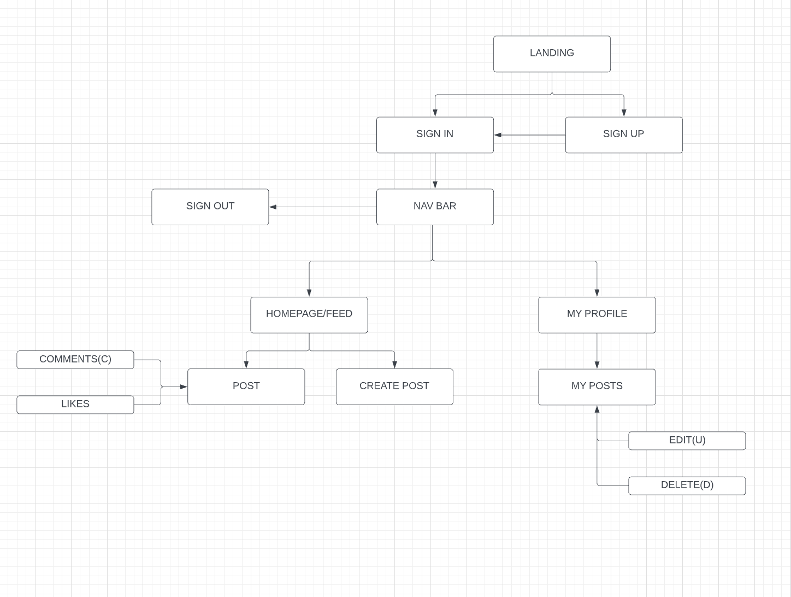
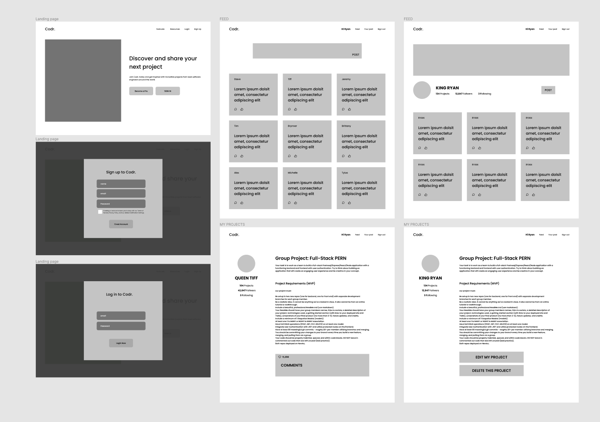
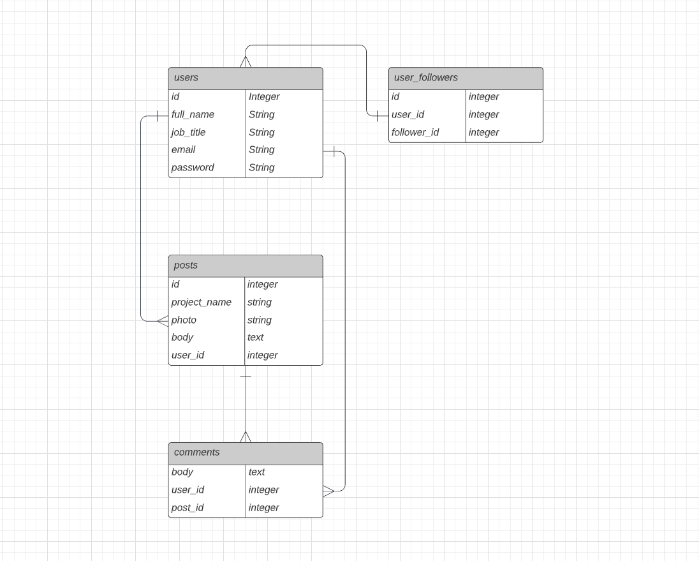

# **Codr.**

#### Group 3 Project

## 

---

#### Tiffany Pereira| [GITHUB](https://github.com/tiffpereira) | [LINKEDIN](https://www.linkedin.com/in/tiffanympereira/)

#### Steven DeLitta | [GITHUB](https://github.com/yusongsh) | [LINKEDIN](https://www.linkedin.com/in/steven-delitta/)

#### Yusong Shi | [GITHUB](https://github.com/yusongsh) | [LINKEDIN](https://www.linkedin.com/in/yusong-sh/)

#### Ryan Ditzel | [GITHUB](https://github.com/ryanditzel) | [LINKEDIN](https://www.linkedin.com/in/ryanditzel/)

## Technologies Used:

### Github, Figma, Trello, VS Code, and ~~our brains~~

---

## **_Summary_**

For our project 3 we decided to create Codr, a one stop shop for all coders looking to express themselves. Similar to Twitter, Codr will have a feed consisting of user’s posts about their coding projects. You will have the ability to like and comment on the posts in your feed. Similarly, you’ll be able to create your own posts about your projects where users can comment and like. Your posts will have the ability to be updated and deleted.

## **_Front End_**

We will build a fully functional React app with a landing page where you will be able to sign in or sign up if you are not already registered. Once past the log in page you'll see your main feed where all posts will be visible. There will be a Navigation Bar with links to Feed, Your Profile, and Sign Out. Below that will be a text box where you can create a post.

## **_Back End_**

Our database will consist of Falso created posts, comments, and profiles. You will have the ability to add a new profile to the page by registering and logging in.

---

## **_Resources_**

### - [Trello](https://trello.com/b/rqLE2h1M/p3)

### - [Github](https://github.com/RTSY-P3)

### - [Figma](https://www.figma.com/proto/hpaDK92DO77d5orXoney7X/Untitled?page-id=0%3A1&node-id=2%3A2&viewport=241%2C48%2C0.2&scaling=scale-down)
